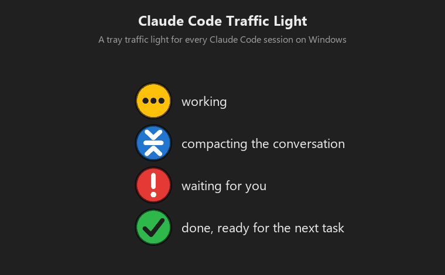

# Claude Code Traffic Light

A tray traffic light for [Claude Code](https://claude.com/claude-code) on Windows. One small `.exe`, no installer.

**Beta (0.9).** Everything described here works and was tested, but not yet on many different computers (display scaling, screen readers, several monitors). Changes are listed in [CHANGELOG.md](CHANGELOG.md); problems and ideas are welcome in [Issues](https://github.com/BelalovBM/claude-code-traffic-light/issues) (the report of `--selfcheck`, see below, helps a lot with anything about the look).

| Colour | Meaning |
|---|---|
| 🟡 yellow | Claude Code is working |
| 🟡 yellow with clock hands | Claude only waits for a background task it started (a build, tests) and goes on by itself when it ends |
| 🔵 blue | Claude Code is compacting the conversation (can take a few minutes); you get a pop-up when it starts and when it ends |
| 🔴 red | Claude Code is waiting for you (for example a permission prompt) |
| 🟢 green | the task is finished, ready for the next one |
| ⚪ grey | no active sessions |

It works with Claude Code in the console and in the VS Code extension, and shows every running session at once. The icon shows the most urgent state.




## Quick start

1. Download `ClaudeCodeTrafficLight.exe` from the [releases page](https://github.com/BelalovBM/claude-code-traffic-light/releases) and run it. No administrator rights are needed.
2. Answer **Yes** to "Connect to Claude Code". The app adds hooks to `~/.claude/settings.json` (the original is backed up once as `settings.json.trafficlight.bak`).
3. Start Claude Code as usual. Sessions started before connecting need a restart.

Claude Code started inside WSL is not supported yet: it keeps its settings in the Linux home folder, out of reach of the hooks. If the program finds such an installation in a running WSL distribution, the **Claude Code** page of the settings says so.

Windows SmartScreen may warn about an unsigned file: choose **More info → Run anyway**. The source code is here, and the build is a single script.

## Features

- Several sessions at once: tray menu lists them with state and time, named after the chat title.
- **Show window**: brings the terminal or VS Code window of the chosen session to the front.
- Sound and pop-up when Claude waits for you or finishes; each can be switched off, globally or per session. The tray menu pauses everything on this computer for an hour, until the end of the day or until you resume it; the phone is not affected: it has its own switch.
- A keyboard shortcut (Win+Alt+C by default, changed or switched off on the **General** page) opens the waiting request with the keyboard focus in it, or the tray menu when nothing waits.
- When Claude ends its turn only to wait for a background task it started (a build, tests), the lamp shows clock hands ("waiting for its background task") and nothing reports it as finished, however long the task runs: the app sees whether the task's process is still running. If the wait goes on for 30 minutes (changed or switched off on the **Notifications** page), you get one notice here and on the phone: a stuck task or a server left running would otherwise look like work for ever. The session counts as finished only when no task process is left and Claude does not go on within 30 minutes.
- Push to your phone through [ntfy](https://ntfy.sh), only when you are probably away (a notification on the computer that you did not react to, a panel left untouched for a minute, or a locked screen): after a permission prompt stays unanswered for N minutes, or when a task that ran at least N minutes finishes. A quick on/off switch is in the tray menu.
- Claude's usage limits (the 5-hour window and the week) with their reset times: at the top of the tray menu, on the second line of the icon tooltip and at the end of every push; optionally a notice (here and on the phone) every N percent, when a limit runs out and when it is back. See [Usage limits](#usage-limits).
- 7 languages (English, Russian, Spanish, German, French, Portuguese, Chinese), light/dark/system theme, autostart.

## Phone notifications (ntfy)

1. Install the free ntfy app (Android / iOS).
2. In the tray app open **Settings → Phone**, enable ntfy, scan the QR code or subscribe to the shown topic manually.
3. Press **Send test**.

The topic name works like a password: anyone who knows it can read and send messages to it. A long random one is generated for you; keep it private. By default a push contains only the project folder name; the chat title and Claude's message text are sent only if you enable "Include Claude's message text". You can use your own ntfy server.

## Your own ntfy server (optional)

In **Settings → Phone → ntfy server** choose **My own ntfy server** and enter its address, for example `https://ntfy.example.org`. For a server with access control enter a user name and password, or an access token (it starts with `tk_`; leave the user empty). The secrets are stored encrypted, and they stay remembered when you switch back to the public ntfy.sh (which never receives them). The phone listens on one server only, so after a switch subscribe to the topic again in the ntfy app.

A minimal Docker setup with access control:

```
docker run -d --name ntfy -p 8080:80 -v ntfy-data:/var/cache/ntfy \
  -e NTFY_BASE_URL=http://localhost:8080 -e NTFY_CACHE_FILE=/var/cache/ntfy/cache.db \
  -e NTFY_AUTH_FILE=/var/cache/ntfy/user.db -e NTFY_AUTH_DEFAULT_ACCESS=deny-all \
  binwiederhier/ntfy serve
docker exec -it ntfy ntfy user add alice
docker exec ntfy ntfy access alice "ccl-*" read-write
docker exec ntfy ntfy access alice "ccr-*" read-write
docker exec ntfy ntfy access everyone "ccr-*" write-only
```

Topics created by this app start with `ccl-` (notifications) and `ccr-` (answers to permission prompts). The last rule lets the Allow/Deny buttons on the phone post an answer without signing in; only your own account can read those topics. Use `https` for a server that is reachable from the internet.

This was tested against the official ntfy image with a normal user, an access token and exactly these access rules (password and token modes, sending, and answering).

## Answer permission prompts and questions without the window (off by default)

When Claude Code asks permission to run a command or change a file, you can answer without going back to its window, in two ways. Both are off by default and are switched on in **Settings → Permission prompts**:

- **On this computer:** a small panel near the tray shows the request in full (a command, or a question with its answers) with **Allow** / **Deny** or one button per answer. When Claude Code offers a rule so it does not ask again, there is also **Allow and don't ask again**, with that rule shown under it (on the phone: **Always**). The panel does not take the keyboard focus. **Later** closes it; the tray menu entry of that session opens it again. A typed answer ("Other") is not possible there: the panel offers to open the session window.
- **From the phone (experimental, needs ntfy):** the phone gets a push with the same buttons.

A question with answer options (a single question, one choice) works the same way: the options become the buttons or menu items (the phone shows at most three), and the chosen answer goes back to Claude Code. Questions of other shapes stay on the screen.

Think before enabling it:
- Whoever can tap **Allow** lets Claude Code act on your computer. Security rests on secret topic names on the ntfy server (they work like passwords), and the push contains the tool name and the command or file path. The ntfy server sees each request and your answer. Your own ntfy server with a password is safer than the public one.
- A fresh secret reply topic and a one-time token per request are used, so an old or guessed token does nothing. Allow and Deny apply once; only **Always** adds a permanent rule, and only the one Claude Code itself offered for that request, shown in the push.
- Nothing is ever approved without a valid answer: on timeout, if you answer on the computer first, if the session is muted (for the phone) or the app is not running, Claude Code simply shows its normal prompt.
- The feature adds a `PermissionRequest` hook to Claude Code's settings only while it is switched on.

How it was checked: the whole cycle (request, push with buttons, tap, decision, wrong and replayed tokens, timeout, answer on the computer first) was tested against a local ntfy-compatible server. How the action buttons behave on your phone depends on the ntfy app, so use **Send test request** first.

## How it differs from Remote Control

Claude Code's own Remote Control lets you continue a session from claude.ai or the Claude app: you see the whole conversation and can type into it. This program does something smaller:

- It shows at a glance, in the tray, which of all your sessions works, waits or is done, without opening any of them.
- It tells you only when something needs you: a pop-up on the computer, and a push to the phone only when you did not react there.
- A permission prompt or a question with answer options can be answered with one tap, on the computer or on the phone, without the conversation.
- It needs no account features: the notifications go through ntfy, which can be your own server.

The two do not get in each other's way: use the traffic light to know when to look, and Remote Control when you need the whole session.

## Usage limits

The menu shows how much of Claude's 5-hour and weekly limits is used, as `/usage` does. Claude Code gives these figures to no hook, and its status line, which gets them, does not run in VS Code. So the app takes them from where Claude Code itself keeps them: whenever you run `/usage` (or reach a limit), Claude Code saves the exact figures in `~/.claude.json`.

Between two `/usage` runs the app estimates what was used since from the session transcripts on this computer and adds it to the last exact figure; such a figure is marked with `≈`. How much a token counts is learnt from your own `/usage` figures, separately for each model, newer figures counting more, so the estimate follows a change of model or plan by itself. Every new `/usage` puts the figures right again; the more often you run it, the closer the estimate. Use of Claude on other devices (claude.ai, the phone, another computer) is not in the transcripts here, so it shows up only at the next `/usage`. So far the estimate has stayed within one or two percentage points of the next `/usage`; Anthropic shows whole percentages, so about one point is the closest it can be.

The app never contacts Anthropic and never reads or uses your Claude sign-in: Anthropic does not allow other programs to use it. The exact figures it has seen are kept in `usage-limits.json` next to the program. The **Notifications** page switches each part on or off.

## How it works

Claude Code runs a hook on every event. The hook is this same `.exe` started with `--hook`; it reads the event and passes it to the running tray app through a local named pipe. If the tray app is not running, the hook exits silently and never disturbs Claude Code. Nothing leaves your computer except the optional ntfy push. No telemetry.

As a fallback, the app also reads the small per-process files Claude Code keeps in `~/.claude/sessions` (session id, folder, busy/idle). This lets it find sessions that were already running when it started, and notice that a task was interrupted (which fires no hook). That file format is not a documented interface and may change between Claude Code versions; if it does, only this fallback stops working, the hooks are unaffected.

## Uninstall

1. **Settings → Claude Code → Remove everything…** disconnects Claude Code (only this app's hooks are removed, other hooks stay), turns off autostart, removes the notification registration (the program shows its notifications under its own application id, a single key under `HKCU\Software\Classes\AppUserModelId`), deletes its settings, log, requests journal and usage figures (they sit next to the .exe) and exits. The original `settings.json.trafficlight.bak` backup is kept.
2. Delete the `.exe` (its folder opens automatically).

To only disconnect from Claude Code and keep the program, use **Disconnect** on the same page.

## Privacy

The program collects nothing and sends nothing about you or how you use it: no telemetry, no update checks. It uses the network only when you set up the phone: then it sends notifications to the ntfy server you chose (ntfy.sh or your own) and listens there for your answers. What the notifications contain (the name of a session, the text of a request) is described on the Phone and Permission prompts pages. For the usage limits it reads, on this computer only, the session transcripts and the figures Claude Code keeps in `~/.claude.json`; nothing of it is sent anywhere, except the line with the percentages at the end of a push when that is switched on. Everything else stays on the computer: the settings, the log, the requests journal and the usage figures sit next to the program and are removed by **Remove everything**.

## Verifying the download

The release files are not code-signed, so Windows SmartScreen may warn on the first start (**More info → Run anyway**). What makes them checkable instead:

- Every release is built by GitHub Actions from the tagged source code (`.github/workflows/build.yml`), and the build is deterministic: building the same commit gives a byte-identical file.
- `SHA256SUMS.txt` in each release lists the checksum of the exe. Compare it with `Get-FileHash ClaudeCodeTrafficLight.exe` in PowerShell.

The program sends nothing anywhere unless you set up the phone notifications; see [Privacy](#privacy).
## Self-check

`ClaudeCodeTrafficLight.exe --selfcheck` shows the program with made-up sessions, takes a picture of every window (settings pages in both themes, the tray menu, the request panel, a notification) and writes `report.txt` with the Windows version, the scale of each monitor and the theme, all into a `selfcheck-<date>` folder next to the program. It needs no Claude Code and changes nothing on the computer. It takes about 40 seconds; leave the mouse and keyboard alone meanwhile. Pictures of the menu and the notification are taken from the screen, so a bit of the desktop around them may be in them.

## Build from source

Requires the .NET SDK only for building (the result runs on the .NET Framework 4.8 that ships with Windows):

```powershell
powershell -File build.ps1      # -> bin\ClaudeCodeTrafficLight.exe
powershell -File tools\make-icon.ps1   # regenerates src\app.ico
```

To add a language, copy `lang\en.txt` to `lang\<code>.txt` and translate it. A `lang` folder next to the `.exe` overrides the built-in texts.

## License

Copyright © 2026 BelalovBM. Licensed under the [GNU General Public License v3.0](LICENSE).

## Support the project

If you like the program and want to support the development of similar projects, you can donate. See [DONATE.md](DONATE.md).

TRON network (TRX, TRC-20 tokens such as USDT): `TUKeo9zL3YwwmBdh2pr2HfetANm32UtD4x`
